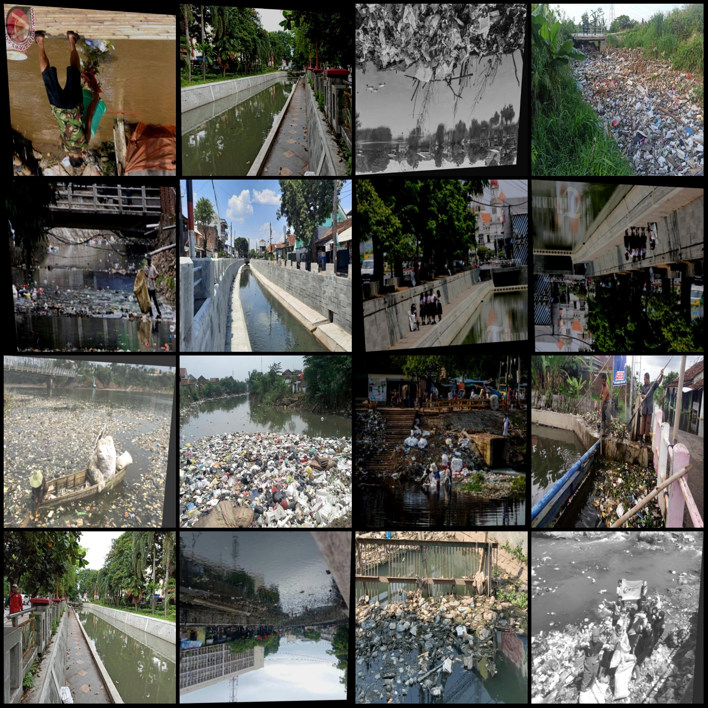
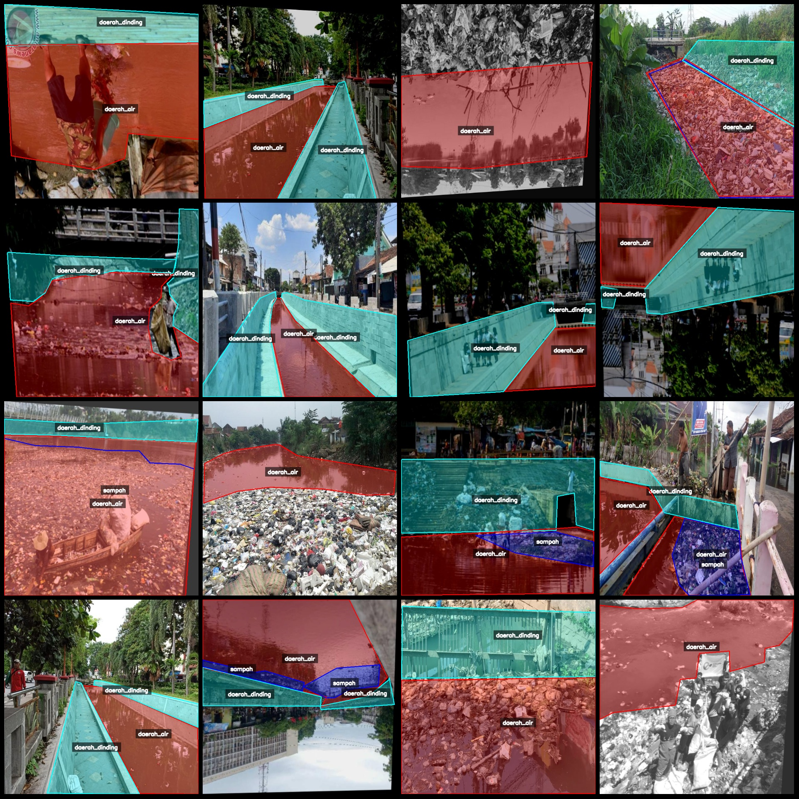
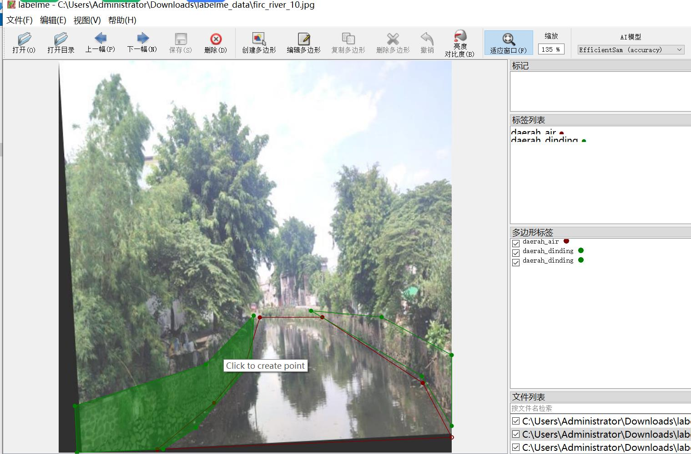

# River Waterway Wall Area Garbage River Elements Identification and Segmentation Dataset - Labelme format - 147 images, 4 categories

Please note that more than half of the dataset images are enhanced.
Dataset format: LabelMe format (excluding mask files, only containing jpg image and corresponding json file)
number of images: 147  
annotation count: 147  
annotationnumber of classes: 4  
annotation class names:["daerah_air","daerah_dinding","sampah","trash_barrier"]  
daerah air (water area) count = 142
daerah dinding (wall area) count = 179
sampah (trash) count = 66
trash barrier (trash barrier) count = 9
total boxes: 396  
Use annotation tool: labelme=5.5.0
image resolution: 640x640  
Annotation Rules: Drawing polygons around the class for polygon annotation
Important Notes: You can open and edit the dataset using labelme. The jsondataset needs to be converted into a mask, Yolo format, or COCO format for semantic segmentation or instance segmentation.
Special Statement: This dataset does not guarantee the precision of the trained model or weight file.
Image Preview:
Annotation Example:
Original Image (randomly selected 16 images):
Annotation drawing result:
Labelme editing image example:
## Images

Here is a pay link on Stripe ( https://buy.stripe.com/3cs8yP7sY87d0vu9AB ). Please contact me lonlonago@foxmail.com after funding $89, and I will send you a complete data files , thank you!

